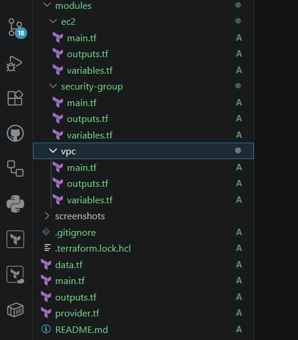
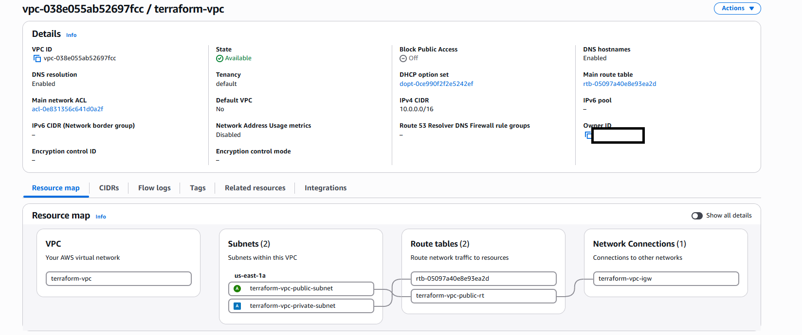
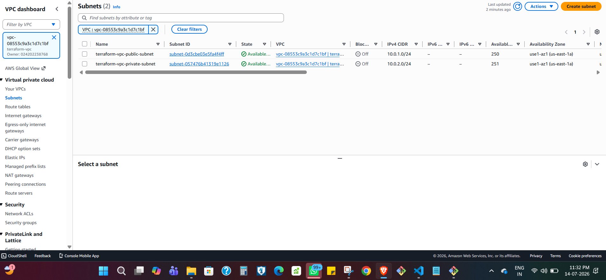
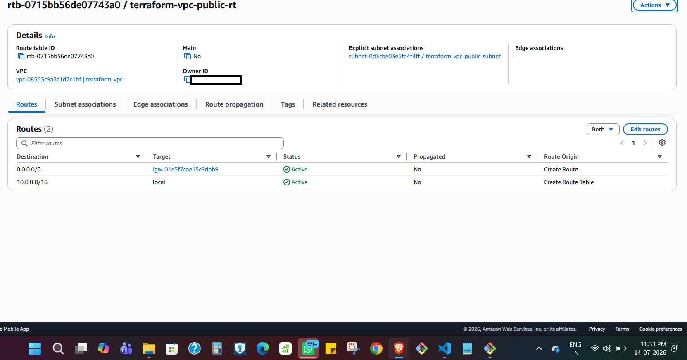
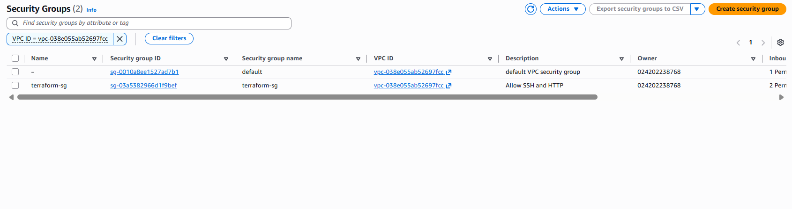
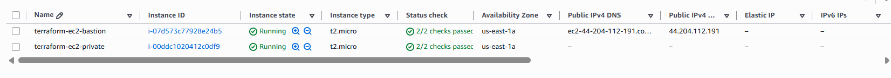
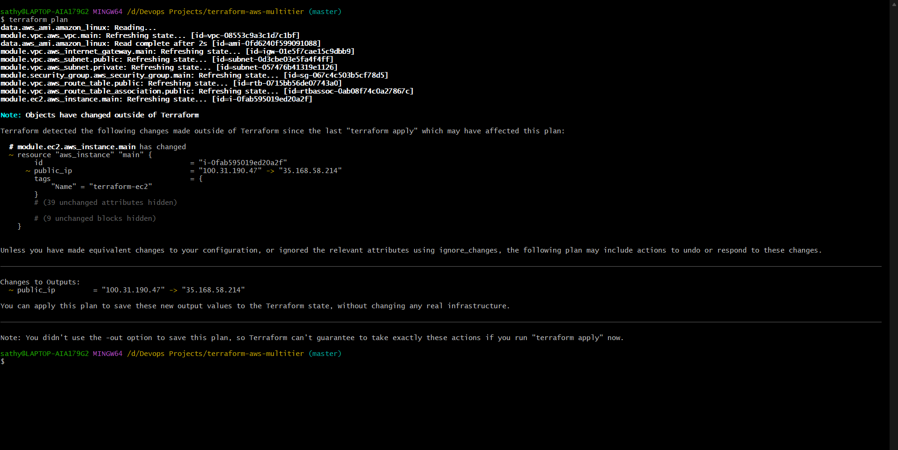

# 🚀 AWS Multi-Tier Infrastructure Automation using Terraform


## 📌 Project Overview

This project demonstrates how to provision a complete AWS multi-tier infrastructure using **Terraform Infrastructure as Code (IaC)**.

Instead of manually creating resources through the AWS Management Console, the entire infrastructure is deployed using reusable Terraform modules and declarative configuration files.

The project follows Infrastructure as Code best practices, including modular design, reusable variables, outputs, state management, and automated provisioning.

---

# 🏗️ Architecture


---

# ☁️ AWS Services Used

- Amazon VPC
- Public Subnet
- Private Subnet
- Internet Gateway
- Route Table
- Route Table Association
- Security Group
- Amazon EC2

---

# 🛠 Technologies Used

- Terraform
- AWS
- EC2
- VPC
- Git
- GitHub

---

# 📂 Project Structure

```
terraform-aws-multitier/
│
├── provider.tf
├── versions.tf
├── variables.tf
├── terraform.tfvars
├── outputs.tf
├── main.tf
├── data.tf
├── .gitignore
├── README.md
│
├── modules/
│   ├── vpc/
│   ├── security-group/
│   └── ec2/
│
└── screenshots/
```

---

# ⚙️ Features

- Modular Terraform project structure
- Infrastructure as Code (IaC)
- Automatic VPC provisioning
- Automatic subnet creation
- Internet Gateway configuration
- Route Table configuration
- Security Group creation
- EC2 provisioning
- Latest Amazon Linux AMI fetched using Terraform Data Source
- Reusable variables
- Outputs for important resource IDs
- Easy deployment using Terraform CLI

---

# 📖 Terraform Workflow

Initialize Terraform

```bash
terraform init
```

Format Terraform files

```bash
terraform fmt
```

Validate configuration

```bash
terraform validate
```

Preview infrastructure

```bash
terraform plan
```

Deploy infrastructure

```bash
terraform apply
```

Destroy infrastructure

```bash
terraform destroy
```

---

## Project Structure



## VPC



## Subnets



## Route Table



## Security Group



## EC2 Instance



## Terraform Plan



# 🎯 Skills Demonstrated

- Infrastructure as Code (IaC)
- AWS Networking
- Terraform Modules
- Terraform Variables
- Terraform Outputs
- Terraform Data Sources
- State Management
- Resource Dependencies
- EC2 Deployment
- Security Group Configuration
- Git Version Control

---

# 📚 Key Terraform Concepts Learned

- Providers
- Resources
- Variables
- Outputs
- Modules
- Module Inputs & Outputs
- Data Sources
- Resource References
- State File
- terraform init
- terraform validate
- terraform fmt
- terraform plan
- terraform apply
- terraform destroy

---

# 🚀 Future Improvements

- Remote Backend (S3)
- DynamoDB State Locking
- Auto Scaling Group
- Application Load Balancer
- NAT Gateway
- RDS Database
- CI/CD Deployment using GitHub Actions
- Kubernetes Deployment

---

# 📝 # 💼 Resume Highlights

**AWS Multi-Tier Infrastructure Automation using Terraform**

- Automated provisioning of AWS infrastructure using Terraform Infrastructure as Code (IaC).
- Developed reusable Terraform modules for VPC, public/private subnets, Internet Gateway, route tables, security groups, and EC2 instances.
- Implemented modular, scalable, and reusable infrastructure using variables, outputs, and data sources.
- Reduced manual infrastructure provisioning by deploying cloud resources through declarative Terraform configuration.

# 👨‍💻 Author

**Sathya Moorthy S**


---

⭐ If you found this project useful, feel free to star the repository.s