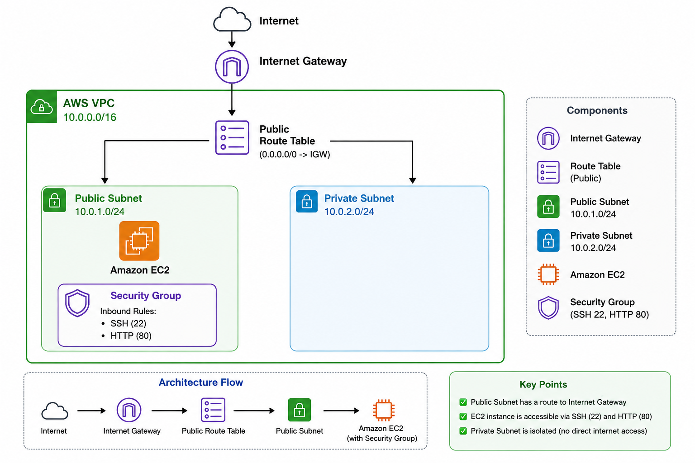

# AWS Infrastructure Automation with Terraform

> **TL;DR:** Modular Terraform project that provisions AWS networking and compute infrastructure using Infrastructure as Code. The configuration creates VPC networking components, security groups, and multiple EC2 resources (including a public bastion host and an isolated private instance) through reusable Terraform modules, variables, outputs, and an AWS AMI data source.

## Overview

This project provisions AWS infrastructure using Terraform instead of creating each resource manually through the AWS Management Console.

The Terraform configuration is organized into reusable modules for VPC networking, security groups, and EC2 resources. Variables are used to pass configuration into the modules, while outputs expose important information about the provisioned infrastructure.

An AWS data source is used to retrieve the required Amazon Machine Image dynamically rather than hardcoding a specific AMI ID.

This project automates a multi-tier VPC and EC2 architecture pattern, using Terraform to make the infrastructure repeatable and version-controlled rather than configured by hand through the AWS Management Console.

The project was built to gain hands-on experience with Infrastructure as Code, Terraform module design, resource dependencies, variables, outputs, data sources, state management, and the Terraform provisioning lifecycle.

## Architecture



The infrastructure is provisioned through Terraform and includes AWS networking and multi-tier compute resources.

The provisioning flow is:

1. Terraform initializes the AWS provider.
2. The VPC module creates the required networking resources.
3. Public and private subnet resources are created within the VPC.
4. An Internet Gateway and routing configuration provide connectivity for the public network segment.
5. Security Groups define the required instance-level network access.
6. An AWS data source retrieves the required Amazon Linux AMI.
7. The EC2 module is called multiple times by the root configuration to provision both a public bastion host and an isolated private instance with customized public IP mapping flags.
8. Terraform outputs expose selected resource information after provisioning.

The infrastructure configuration is defined declaratively in Terraform and can be reviewed with `terraform plan` before resources are created or modified.

## Technology Stack

| Technology | Role in the Project |
|---|---|
| Terraform | Infrastructure provisioning and configuration |
| AWS | Cloud infrastructure platform |
| Amazon VPC | Provides the network boundary |
| Subnets | Separate network segments within the VPC |
| Internet Gateway | Provides internet connectivity for the public network segment |
| Route Tables | Define network routing behavior |
| Security Groups | Control instance-level network access |
| Amazon EC2 | Provides multi-tier compute instances (Bastion and Private workload) |
| Terraform Data Source | Dynamically retrieves AWS resource information |
| Git | Version control |
| GitHub | Source code repository |

## Project Structure

```text
terraform-aws-multitier/
│
├── provider.tf
├── versions.tf
├── variables.tf
├── terraform.tfvars
├── outputs.tf
├── main.tf
├── data.tf
├── .gitignore
├── README.md
│
├── modules/
│   ├── vpc/
│   ├── security-group/
│   └── ec2/
│
└── screenshots/
The Terraform configuration is separated by responsibility:

provider.tf — configures the AWS provider.

versions.tf — defines Terraform and provider version requirements.

variables.tf — declares input variables used by the root configuration.

terraform.tfvars — supplies environment-specific variable values and is excluded from version control.

main.tf — connects and invokes the Terraform modules (instantiating the EC2 module for both public bastion and private workloads).

data.tf — defines data sources used to retrieve existing AWS information.

outputs.tf — exposes selected infrastructure values after deployment.

modules/vpc/ — contains the VPC and networking configuration.

modules/security-group/ — contains Security Group configuration.

modules/ec2/ — contains reusable EC2 provisioning configuration supporting conditional public IP assignment.

Infrastructure Provisioned
The Terraform configuration provisions the infrastructure required by the project, including:

Custom VPC

Public and private subnet resources

Internet Gateway

Route table configuration

Route table associations

Security Groups

Public Amazon EC2 Bastion host

Isolated private Amazon EC2 instance

The exact infrastructure configuration is controlled through the Terraform root configuration and module inputs.

Technical Decisions and Considerations
Modular Terraform Structure
The infrastructure is divided into separate modules for:

Plaintext
VPC
Security Groups
EC2
This separates networking, security, and compute configuration instead of defining every resource in a single Terraform file.

The root module connects these components by passing outputs from one module as inputs to another where required, and reuses the EC2 module across different subnets.

For example, networking resources must exist before resources that depend on VPC or subnet identifiers can be configured.

This structure was used to gain practical experience with Terraform module composition and resource relationships.

Variables for Configuration
Input variables are used to avoid hardcoding configurable values throughout the Terraform resources.

Values can be supplied through:

Plaintext
terraform.tfvars
and passed from the root configuration into the individual modules.

This separates configurable infrastructure values from the underlying resource definitions.

The terraform.tfvars file is excluded from version control through .gitignore to avoid committing environment-specific values to the repository.

Module Inputs and Outputs
Terraform module outputs are used to pass resource information between different parts of the configuration.

For example, a resource created by the VPC module can expose its ID as an output, allowing another module to use that value without duplicating or hardcoding the resource identifier.

This demonstrates how independently organized Terraform modules can be connected through explicit inputs and outputs.

Dynamic AMI Selection
The project uses a Terraform data source to retrieve the required Amazon Linux AMI instead of hardcoding a specific AMI ID.

This avoids tying the configuration to a manually copied AMI identifier and demonstrates how Terraform can query existing AWS information during planning.

The selected AMI should still be reviewed when applying the configuration because dynamically selected images can change over time depending on the data source filters.

Declarative Infrastructure Management
The AWS resources are defined through Terraform configuration rather than being created individually through the AWS Management Console.

The intended infrastructure changes can be reviewed before deployment using:

Bash
terraform plan
Terraform compares the declared configuration with the infrastructure recorded in its state and determines the actions required to reach the desired configuration.

Resource Dependencies
Dependencies between infrastructure components are expressed through Terraform resource references and module inputs.

For example, resources that require a VPC, subnet, or Security Group reference use values produced by the corresponding resources or modules.

This allows Terraform to determine the dependency order required during provisioning instead of relying on a manually defined resource creation sequence.

Local State Management
This project currently uses local Terraform state.

The local state files are excluded from version control through .gitignore and remain on the machine where Terraform is executed.

Local state is sufficient for the scope of this single-person learning project, but it would not be appropriate for a collaborative environment where multiple engineers need to manage the same infrastructure.

For a shared environment, a remote backend such as Amazon S3 could provide centralized state storage together with an appropriate state-locking mechanism to prevent conflicting concurrent Terraform operations.

Terraform Workflow
1. Initialize
Initialize the working directory and download the required provider plugins:

Bash
terraform init
2. Format
Format the Terraform configuration:

Bash
terraform fmt -recursive
3. Validate
Check the configuration for syntax and internal consistency:

Bash
terraform validate
Expected successful validation:

Plaintext
Success! The configuration is valid.
4. Review the Plan
Preview the infrastructure changes:

Bash
terraform plan
The execution plan should be reviewed before applying changes to understand which resources Terraform intends to create, modify, or destroy.

5. Provision the Infrastructure
Apply the configuration:

Bash
terraform apply
Review the proposed changes and confirm the apply when ready.

6. Review Outputs
After provisioning, view the configured Terraform outputs:

Bash
terraform output
Outputs provide selected information about resources created by the configuration.

7. Destroy the Infrastructure
When the environment is no longer required:

Bash
terraform destroy
Review the destruction plan before confirming removal of the Terraform-managed resources.

Verification
The Terraform configuration was verified through the standard Terraform workflow.

Configuration validation:

Bash
terraform validate
Infrastructure change preview:

Bash
terraform plan
Provisioning:

Bash
terraform apply
Configured outputs:

Bash
terraform output
The AWS Management Console was also used to verify that the expected VPC, subnet, routing, Security Group, and multi-tier EC2 resources were created after the Terraform apply completed.

The following were verified during the project:

Terraform configuration passed terraform validate.

Terraform generated an execution plan before deployment.

AWS resources were provisioned through terraform apply.

VPC networking resources were created successfully.

Security Group resources were created successfully.

Multi-tier EC2 resources (Bastion and private instance) were provisioned successfully with proper public/private IP configurations.

Terraform outputs returned the configured resource information.

Selected Project Evidence
The following screenshots highlight the main Terraform and AWS provisioning results.

Terraform Execution Plan
Shows the Terraform execution plan used to review proposed infrastructure changes before provisioning.

Terraform Apply
Shows successful infrastructure provisioning through the Terraform apply workflow.

VPC
Shows the VPC provisioned through the Terraform configuration.

Security Group
Shows the Security Group provisioned for instance-level network access.

EC2 Instance
Shows the EC2 instances provisioned through the reusable Terraform EC2 module.

Additional screenshots, including the project structure, subnet resources, and route table configuration, are retained in the screenshots/ directory as supporting project evidence.

Limitations and Next Steps
The project focuses on Terraform fundamentals, modular infrastructure design, and automated AWS resource provisioning.

Current limitations and relevant next steps include:

State management: This project currently uses local Terraform state, which is appropriate for a single-person learning environment but does not scale well to collaborative infrastructure management. A remote backend such as Amazon S3 could provide centralized state storage, together with an appropriate state-locking mechanism for concurrent-safe operations in a shared environment.

Private subnet connectivity: A NAT Gateway could be added if workloads in private subnets require outbound internet access while remaining inaccessible to direct inbound internet connections.

Workload architecture: The current project focuses on core networking and multi-tier EC2 provisioning. Load balancing and Auto Scaling could be added if the infrastructure is extended to host a highly available application workload.

Environment separation: Separate Terraform configurations, variable files, or another environment-management strategy could be introduced if the project is expanded to manage environments such as development, staging, and production.

These improvements are intentionally kept outside the current scope so that the project remains focused on understanding Terraform modules, dependencies, local state, data sources, and the infrastructure provisioning lifecycle.